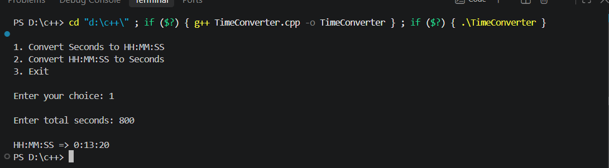

# Time Converter

## Project Description

This project is a C++ utility program that converts time
between total seconds and HH:MM:SS format.

The project uses a class named TimeConverter and a
menu-driven program.

## Features

- Convert seconds to HH:MM:SS
- Convert HH:MM:SS to total seconds
- Menu-driven program
- Uses C++ class and objects

## Example: Seconds to HH:MM:SS

Input:

4200 seconds

Output:

1:10:00

### Output Screenshot

---

## How to Run

1. Open the project in Visual Studio.
2. Compile the C++ program.
3. Run the program.
4. Select an option from the menu.

## Technologies Used

- C++
- Object-Oriented Programming
- Classes and Objects